#  Soda Diner Project 

##  Project background  

Having to work on a project's backend and not being able to make any changes to the client side was tricky to say the least. Being recently introduced to  `Mongoose`, `Mocha`, `Chai`, `Express`, `Nodemon`, `Body-Parser` made things both complicated, but streamlined. Routes being fresh in my head made that less of a chore than I thought, but I also had to really dig and search for info on how to achieve certain goals. I am glad to have such good help from TA's here with me in the classroom. This project was hard all the way through for me, but a very good experience none the less.

###  For this project I employed all of the new things I have learned.  

- Mongoose.
- Mocha.
- Chai.
- Nodemon.
- Body-Parser.
- Express.
- Node.

##  How to use the front end as a user:  

Introduction 
  - At first, the user will encounter the <q> Welcome to Thirsty Mongoose! </q> with links displaying <q> All Sodas and All Diners </q> as a call to action. The purpose of this excercise is to let users add <q> Sodas </q> to a list with a fizziness value, a taste rating value and a serving status, or to update from the list available to them; the purpose of the serving status is to make sodas available at different diners, if the status of serving is <q> false </q>, the soda will not be available for selection at diners to choose from.
 

 First Stage 

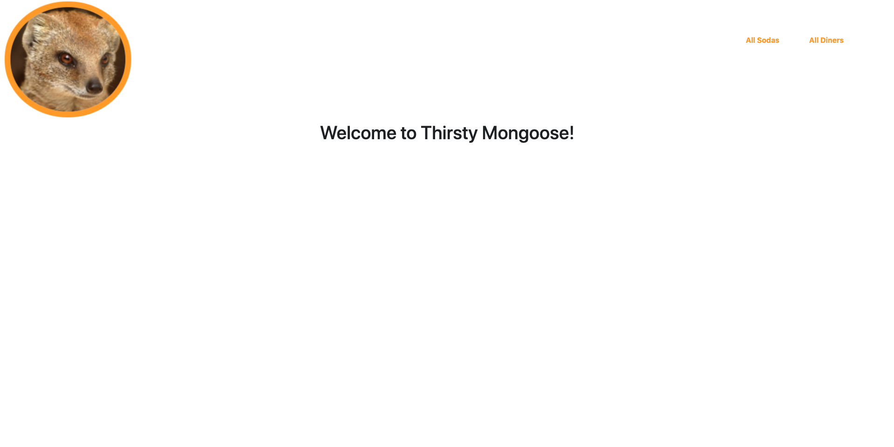

- Clicking the `All Sodas` link will take users to the Sodas page.

 

 Second Stage 

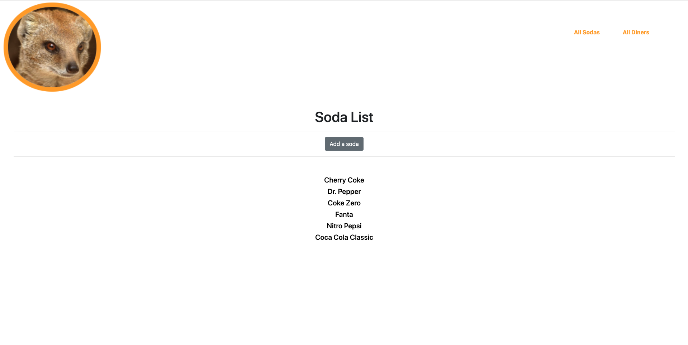

- User will have a list of `Sodas` displayed to them.

- From this list of `Sodas` they are able to choose to update `Brand`, `Fizziness`,and `Taste Rating` by clicking the on the `Soda` name, then clicking the `edit soda` button. `Sodas` on the list and ones added by `users` can be deleted.

 

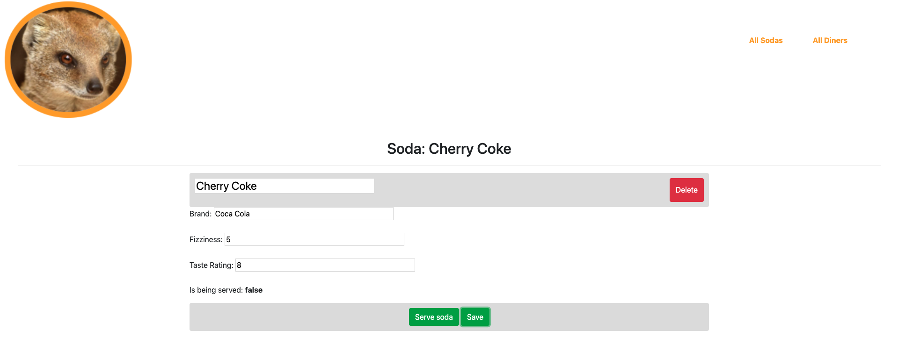

- User will be able to change the `is being served` status from false to true and the other way around by clicking the `serve soda` button.

 

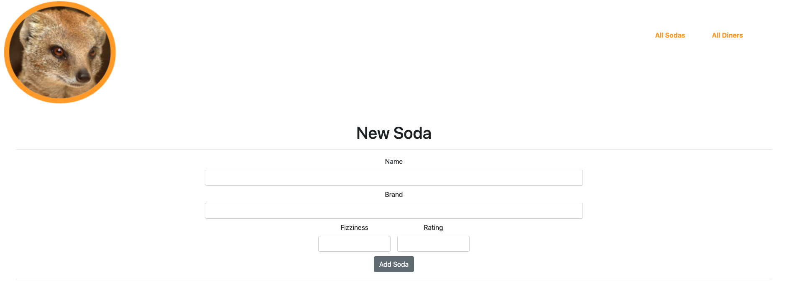

- User can add their own `soda` by clicking the `add a soda` button. Here they can set all parameters to their liking, clicking the `add soda` button will add their `soda` to the database, and the list subsequently. To make the soda available at diners,  they will have to go through the same steps as editing a soda. 

 

 Third Stage 

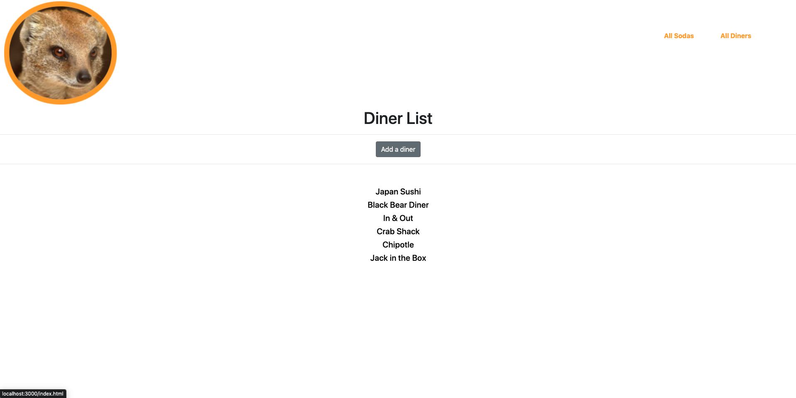

- User will have a list of `Diners` displayed to them.

- From this list of `Diners` they are able to choose to update `Name`, `Location`,and `Sodas` available by clicking the on the `Diner's` name, then `Edit Diner`, then by clicking the `Save` button. To add sodas they will have to click on the `Add a Soda` button, and select from `Sodas` available to serve. `Diners` and `Sodas` on the list and ones added by `Users` can be removed.

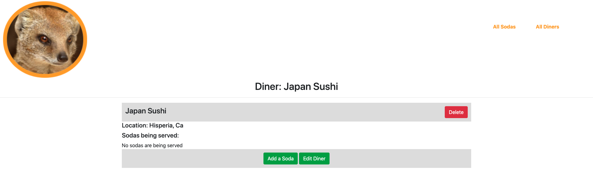

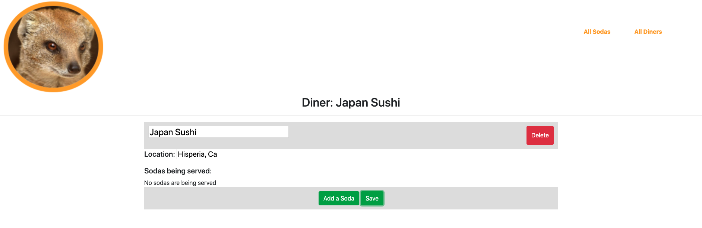

 

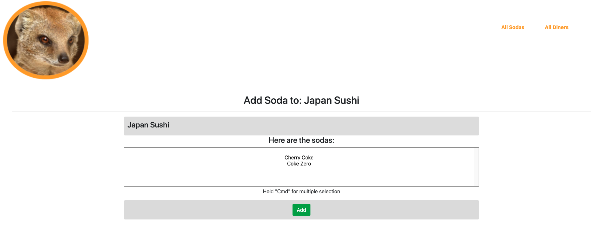

- To add `Sodas` to diner user just has to click the `Add Soda` button, select from `Sodas` available, and click the `Add` button. 

 

 Last Stage 

- Users can add their own `Diner` as well by clicking the `Add a Diner` button.

 

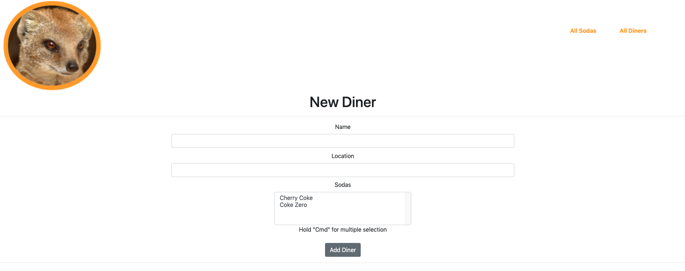

- Users can at this stage add a `Diner` as well add `Sodas` with `serving status of true`. Clicking the `Add Diner` button adds the `Diner` and all parameters to the database and to the list.

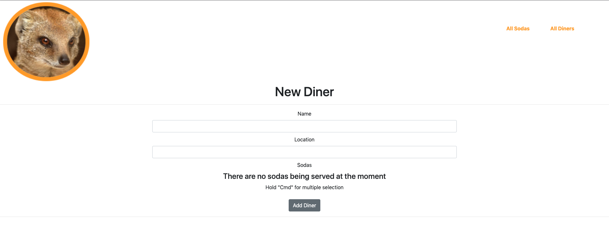

- If there are no `Sodas` with a status set to `True`, a message will display letting the user know there are no `Sodas` available.

 

##  Project styles  

No styles where set by me in this project.

###  Colors used for this project.  

- #faa305
- #fff
- #000
- #80808040
- #dbdbdb
- #dfdfdf

##  How to use the backend:  

### Assuming you are familiar with command line.

 Install dependencies from the package.json file: 

   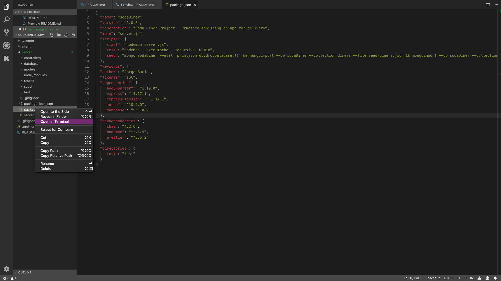
     
   - Head over to the server folder in the directory, then right click on the package.json file. Click `Open in Terminal` then run the command `npm install`. Once the installation process has finished continue on through the next steps.
   

 

 Getting to the Server File 

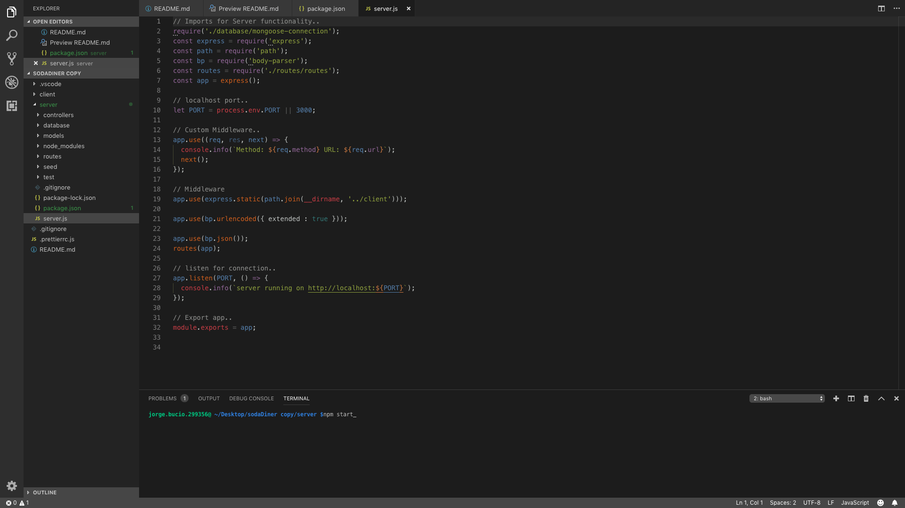

- Open <q> `server.js` </q> file in terminal.

 

 Starting Server 

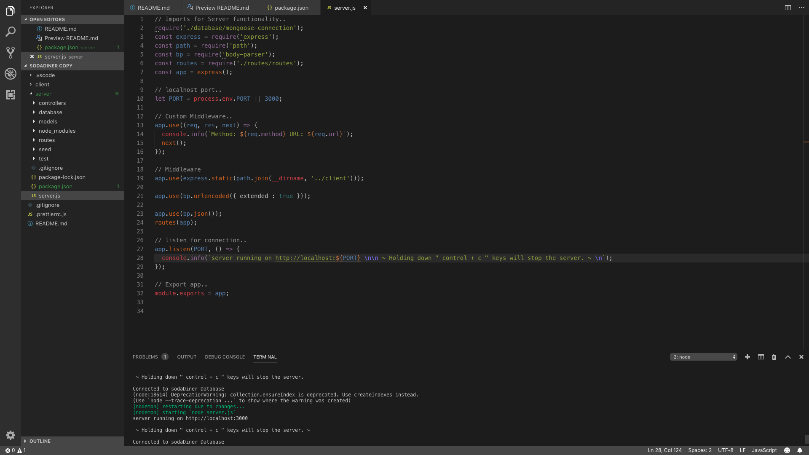

- Type <q> `npm run seed` </q> in the terminal to populate the database with documents to interact with.
- Type <q> `npm start` </q> in the terminal.
- Then open <q> `http://localhost:3000` </q> in your browser.
- Holding down <q> `control + c` </q> keys will terminate the server. 

 

 Running Tests 

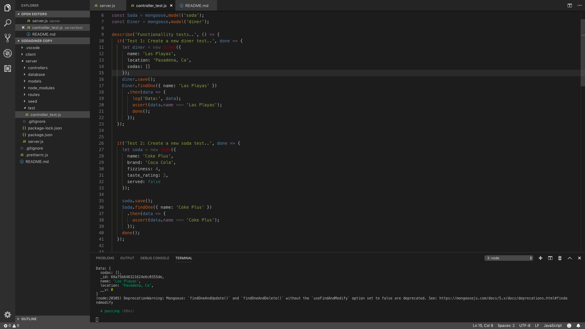

- Head to the test folder and right click on the <q>`controller_test.js`</q> file.
- Click <q>`open in terminal`</q>.
- Type <q> `npm run test` </q> in the terminal.
- All `Tests` should pass as shown in the image.

